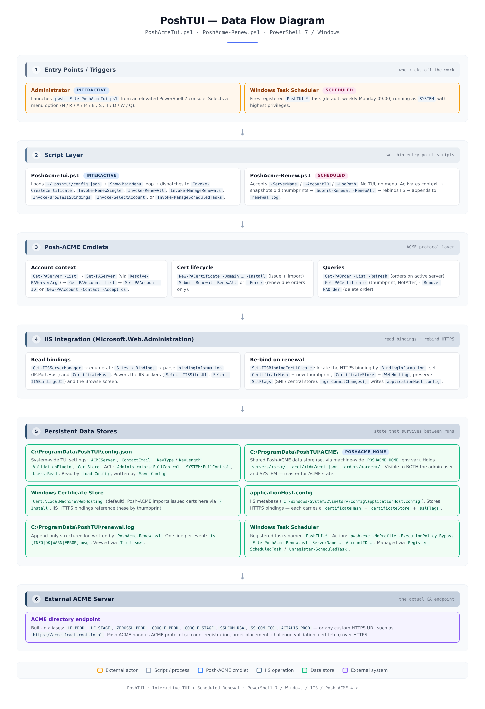

# PoshTUI — A Text User Interface for Posh-ACME on Windows

A PowerShell 7 TUI that wraps the [Posh-ACME](https://github.com/rmbolger/Posh-ACME) module
and looks/feels like Simple ACME (WACS).

```
  ____            _     _____         _      _    ___
 |  _ \ ___ _ __ | |_  |_   _|_ _ ___| | __ | |  / _ \ _ __ ___
 | |_) / _ \ '_ \| __|   | |/ _` / __| |/ / | |  | | | | '_ ` _ \
 |  __/  __/ | | | |_    | | (_| \__ \   <  | |__| |_| | | | | | |
 |_|   \___|_| |_|\__|   |_|\__,_|___/_|\_\ |_____\___/|_| |_| |_|
  A Text User Interface for POSH ACME on Windows (PowerShell 7)
```

## Data flow

> **View the diagram**: open [`poshtui-dataflow.html`](poshtui-dataflow.html) in any browser for the full interactive version, or see the rendered preview below.



The diagram reads top-to-bottom as six phases:

1. **Entry Points** — either an Administrator launching `PoshAcmeTui.ps1`
   interactively, or Windows Task Scheduler firing a registered `PoshTUI-*`
   task (default: weekly Monday 09:00).
2. **Script Layer** — two thin entry-point scripts. The TUI is interactive
   (menu + dispatch); `PoshAcme-Renew.ps1` is non-interactive (renew + rebind
   + log).
3. **Posh-ACME Cmdlets** — the ACME protocol layer: account context
   (`Set-PAServer` / `Set-PAAccount`), cert lifecycle (`New-PACertificate` /
   `Submit-Renewal`), and queries (`Get-PAOrder` / `Get-PACertificate`).
4. **IIS Integration** — `Microsoft.Web.Administration` for reading bindings
   and `Set-IISBindingCertificate` for re-pointing HTTPS bindings to a new
   thumbprint (preserving SslFlags).
5. **Persistent Data Stores** — `~/.poshtui/config.json`, `~/.poshacme/`,
   the Windows Certificate Store (`WebHosting`), `applicationHost.config`,
   `C:\ProgramData\PoshTUI\renewal.log`, and the Task Scheduler itself.
6. **External ACME Server** — the actual CA endpoint (built-in alias or
   custom HTTPS URL like `https://acme.fragt.root.local`).

The interactive and scheduled tracks share phases 3–6 — both ultimately call
the same Posh-ACME cmdlets, hit the same IIS metabase, and persist to the same
data stores. The only difference is who triggers them and whether they show a
TUI.

## Requirements

| Item                                  | Value                                  |
|---------------------------------------|----------------------------------------|
| OS                                    | Windows Server 2016+ / Windows 10+     |
| PowerShell                            | 7.0 or later (`pwsh`)                  |
| IIS                                   | Installed (with IISAdministration mod) |
| Posh-ACME                             | v4.x or later, **installed `-Scope AllUsers`** |
| Privileges                            | Administrator (Run as Administrator)   |

Install prerequisites:

```powershell
# Posh-ACME — MUST be AllUsers scope so both the admin user and the
# SYSTEM account (used by scheduled renewal tasks) can load it from
# C:\Program Files\WindowsPowerShell\Modules\Posh-ACME
Install-Module -Name Posh-ACME -Scope AllUsers -Force

# IISAdministration ships with the IIS role on Windows Server.
# On Windows 10/11 client, enable via:
#   Enable-WindowsOptionalFeature -Online -FeatureName IIS-ManagementScriptingTools
```

The TUI checks for the Posh-ACME module at
`C:\Program Files\WindowsPowerShell\Modules\Posh-ACME` on startup. If it isn't
there, it prints a clear error and exits — install with the command above and
re-launch.

## System-wide configuration & shared ACME store

PoshTUI is designed for **multi-account use on the same machine**: the
interactive administrator AND the `SYSTEM` account (which runs the scheduled
renewal tasks) must see the same Posh-ACME accounts, servers, orders, and
certificates.

To achieve this, PoshTUI uses two system-wide locations:

| Path                                  | Purpose                                            | ACL                                          |
|---------------------------------------|----------------------------------------------------|----------------------------------------------|
| `C:\ProgramData\PoshTUI\config.json`  | TUI settings (ACME server, email, key, etc.)       | Administrators: FullControl, SYSTEM: FullControl, Users: Read |
| `C:\ProgramData\PoshTUI\ACME\`        | Shared Posh-ACME data store (accounts/servers/orders/certs) | Same ACL as above |
| `C:\ProgramData\PoshTUI\renewal.log`  | Append-only log written by `PoshAcme-Renew.ps1`    | Same ACL as above |

On first launch, the TUI:

1. Verifies Posh-ACME is installed at the AllUsers location (exits with a clear error if not).
2. Creates `C:\ProgramData\PoshTUI\` and `C:\ProgramData\PoshTUI\ACME\` with the ACL above.
3. Sets the machine-wide environment variable `POSHACME_HOME=C:\ProgramData\PoshTUI\ACME` (and sets it for the current process too, so no relaunch is needed). Posh-ACME respects this variable as its data directory.
4. **One-time migration**: if you already have Posh-ACME data in `~/.poshacme/` (your user profile) AND the shared store is empty, the TUI offers to copy everything over. Your original `~/.poshacme/` is left intact for rollback safety.

After migration, both the interactive admin user and the SYSTEM account will
read and write the same Posh-ACME data via `POSHACME_HOME`. New accounts you
create via `S: Select / create ACME account` go straight to the shared store.

## Running

```powershell
# From an elevated PowerShell 7 console
pwsh -File .\PoshAcmeTui.ps1
```

## Main menu

| Key | Action                                  |
|-----|-----------------------------------------|
| N   | Create certificate (full options)       |
| R   | Renew a single certificate              |
| A   | Run all renewals (batch)                |
| M   | Manage renewals (view / renew / delete) |
| B   | Browse IIS bindings                     |
| S   | Select / create ACME account            |
| T   | Manage scheduled renewal tasks          |
| D   | Toggle dry-run mode                     |
| W   | Toggle What-If mode                     |
| Q   | Quit                                    |

`D` and `W` are mutually exclusive (turning one ON turns the other OFF).

## What dry-run / What-If do

| Mode    | Behavior                                                                 |
|---------|--------------------------------------------------------------------------|
| Dry-Run | Nothing executes. Each step prints the exact equivalent PowerShell cmdlet string. |
| What-If | Each Posh-ACME cmdlet is invoked with `-WhatIf` (best effort). IIS commands inherit `$WhatIfPreference`. |
| (neither) | Commands run for real.                                                 |

## ACME account & server selection (`S`)

Posh-ACME stores one or more **accounts** per **server**. Use the `S` menu option
to manage them:

- Lists every account on every known server (file-system traversal, no network
  refresh). Each entry shows `[ServerName] AccountID (contact email)`.
- Pick a number → runs `Set-PAServer <srv>` then `Set-PAAccount -ID <id>`, so
  both server and account become active together. The chosen server is also
  written to `~/.poshtui/config.json` as the default `ACMEServer`.
- Press `n` to create a new account:
  - Pick server: existing server number, `p` for LE_PROD, `t` for LE_STAGE, or
    `u <url>` to register a brand-new directory.
  - Enter contact email.
  - Confirms and runs `Set-PAServer <srv>; New-PAAccount -Contact <email> -AcceptTos`.

When you subsequently run **N: Create certificate**, the script checks the chosen
server for any existing `valid` account. If found, it reuses it; otherwise it
creates a new account using the configured `ContactEmail`. This means:

- Use `S` once per machine to set up your LE account.
- After that, `N` will just reuse it — no duplicate accounts.
- To switch accounts (e.g. from staging to production), use `S` again.

## IIS picker (Simple ACME style)

Reused from `test1.ps1`:

1. **Step 1 — Select IIS Sites**: filter by site IDs (`s 1,3`) or `s s` for all.
2. **Step 2 — Filter Host Headers**: pattern (`p example.*`), regex (`r ^.*\.contoso\.com$`), or manual toggle (`s 2`). Empty/wildcard host bindings are excluded.
3. **Step 3 — Choose Common Name (CN)**: pick from the list, enter a number, or type any hostname. Final identifier list is `CN + sorted(unique hosts)`.

## Renewal + IIS re-bind logic

On renewal (single or batch), the script:

1. Snapshots the **old** certificate thumbprint for each affected order *before* renewal.
2. Calls `Submit-Renewal` (single) or `Submit-Renewal -RenewAll` (batch).
3. Re-queries each order's certificate to obtain the **new** thumbprint.
4. Finds every IIS HTTPS binding that was using the **old** thumbprint.
5. Re-points each of those bindings to the **new** thumbprint (preserves SslFlags).

This matches the Simple ACME / WACS behavior of "every binding using the old cert gets the new cert".

## Scheduled renewals (`T`)

Unattended renewals run via a separate, small, non-interactive script that the TUI
registers as a Windows Scheduled Task.

### File layout

| File                    | Purpose                                                |
|-------------------------|--------------------------------------------------------|
| `PoshAcmeTui.ps1`       | Interactive TUI. Use `T` to register/manage tasks.    |
| `PoshAcme-Renew.ps1`    | Non-interactive renewal + IIS re-bind script. Called by the scheduled task. |

Both files must live in the same directory. The TUI auto-detects its own install
path and uses it to build the task's `-File` argument.

### The `T: Manage scheduled renewal tasks` screen

Lists every scheduled task whose name starts with `PoshTUI-` (recommended scope —
keeps the list focused on renewal tasks only). For each task you'll see:

```
Scheduled renewal tasks:
   1: PoshTUI-RenewAll               Ready      next:2025-06-23 09:00  last:2025-06-16 09:00  [Success]
   2: PoshTUI-Renew-Staging          Ready      next:2025-06-23 09:00  last:-                  [Task not yet run]
```

Actions:

| Key    | Action                                                                 |
|--------|------------------------------------------------------------------------|
| `c`    | Create a new scheduled renewal task                                    |
| `r <n>`| Run task #n now (use `l <n>` afterwards to see the log)                |
| `l <n>`| Show the last 50 lines of `C:\ProgramData\PoshTUI\renewal.log`         |
| `d <n>`| Delete task #n                                                         |
| `x`    | Back to main menu                                                      |

### Creating a task (`c`)

1. **Task name** — default is `PoshTUI-Renew-<timestamp>`. The `PoshTUI-` prefix is
   added automatically if you omit it.
2. **Pick ACME account** — choose any account from the `S` picker; the task will
   pass `-ServerName <srv> -AccountID <id>` to `PoshAcme-Renew.ps1` so it always
   activates the right context. Choose `0` to use whatever server/account is
   currently active at run time.
3. **Schedule** — pick one of:
   - `1`: Weekly on Monday at 09:00 *(recommended default)*
   - `2`: Daily at 03:00
   - `3`: Weekly on a different day/time
4. **Confirm** — review task name, script path, server, account, schedule, then
   confirm. The task is registered with:
   - Principal: `SYSTEM`, RunLevel `Highest`
   - Settings: AllowStartIfOnBatteries, DontStopIfGoingOnBatteries, WakeToRun,
     StartWhenAvailable, ExecutionTimeLimit 1h, RestartCount 2 / RestartInterval 15m

### What `PoshAcme-Renew.ps1` does

When invoked (by Task Scheduler or manually):

1. Activate the given `-ServerName` and `-AccountID` (or use the active context).
2. Snapshot the thumbprint of every PAOrder's current certificate.
3. Call `Submit-Renewal -RenewAll` (Posh-ACME only renews orders whose `RenewAfter`
   is past, so running weekly is safe — orders not due are skipped).
4. For each order whose thumbprint changed, find all IIS HTTPS bindings using the
   OLD thumbprint and re-point them to the NEW thumbprint (SslFlags preserved).
5. Append structured log lines to `C:\ProgramData\PoshTUI\renewal.log`.

Exit codes: `0` success, `1` renewal/rebind had at least one error, `2` preflight
failure (cannot access Posh-ACME or IIS). Task Scheduler records these as
`LastTaskResult`.

### Running `PoshAcme-Renew.ps1` manually

```powershell
# Use whatever server/account is currently active
pwsh -NoProfile -ExecutionPolicy Bypass -File .\PoshAcme-Renew.ps1

# Pin a specific server/account
pwsh -NoProfile -ExecutionPolicy Bypass -File .\PoshAcme-Renew.ps1 -ServerName LE_PROD -AccountID abc123

# Custom log path
pwsh -NoProfile -ExecutionPolicy Bypass -File .\PoshAcme-Renew.ps1 -LogPath D:\logs\renew.log
```

### Dry-run output for renewal screens

When Dry-Run is ON, both `R: Renew single` and `A: Run all renewals` print:

- The list of bindings that would be re-bound
- The equivalent `pwsh.exe` action string (for Task Scheduler's "Start a program" field)
- The equivalent `schtasks.exe` one-liner (for elevated `cmd.exe`)

So you can register a task manually if you prefer `schtasks.exe` over the TUI's
`Register-ScheduledTask` flow.

## Configuration

Persisted system-wide to `C:\ProgramData\PoshTUI\config.json` (ACL: Administrators and SYSTEM get FullControl, Users get Read). Editable defaults:

```jsonc
{
  "ACMEServer":        "LE_PROD",   // LE_PROD | LE_STAGE | custom URL
  "ContactEmail":      "",
  "KeyType":           "EC",        // RSA | EC
  "KeyLength":         256,         // RSA: 2048/3072/4096  EC: 256/384
  "ValidationPlugin":  "WebSelfHost", // or any Posh-ACME DNS plugin name
  "DnsPluginArgs":     {},
  "CertStore":         "WebHosting",
  "RenewalDaysBefore": 30
}
```

Posh-ACME's own data directory is set via the machine-wide `POSHACME_HOME`
environment variable (pointing to `C:\ProgramData\PoshTUI\ACME\`) — not stored
in `config.json`. See "System-wide configuration & shared ACME store" above
for details.

In Step 4 of `N: Create certificate` you can override `e`mail, `s`erver, `k`ey type,
`l`ey length, and `v`alidation plugin inline; changes are persisted.

## Notes & limitations

- The `WebSelfHost` validation plugin (HTTP-01 via IIS) is the default. To use a DNS
  plugin instead, set `-v` to e.g. `Cloudflare`, `Route53`, `AcmeDns`, etc. and
  pre-populate plugin args via `New-PAPluginArgs` outside the TUI.
- For multi-domain certificates where no HTTPS binding exists yet for an identifier,
  the post-issuance re-bind step will skip that identifier with an info message.
  Create an HTTPS binding first (any cert) and re-run, or bind manually.
- `Set-IISBindingCertificate` preserves SslFlags (SNI, central cert store, etc.) by
  mutating the existing `Microsoft.Web.Administration.Binding` element in place.
- Removing an order via `M → d` deletes the Posh-ACME order file but does NOT revoke
  the certificate at the CA. Use `Revoke-PACertificate` separately if needed.
